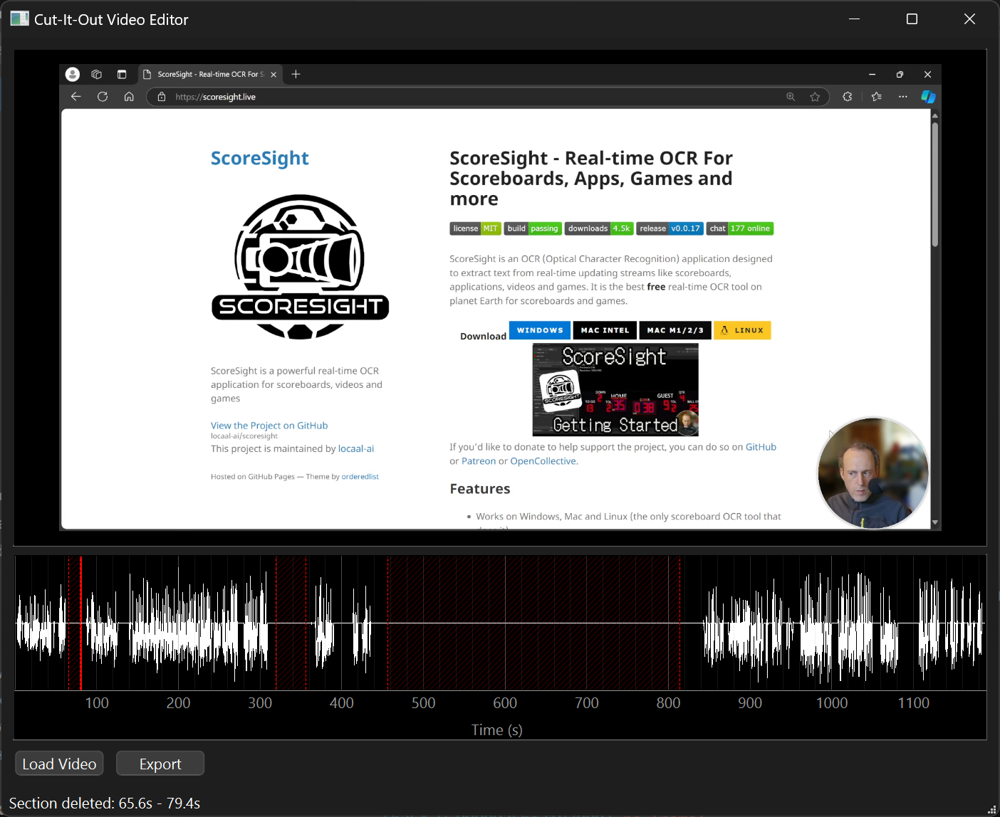

# Cut-It-Out

A lightweight, cross-platform video editor focused on quick and simple cuts. Perfect for removing unwanted sections from video recordings, lectures, or any other video content.



## Features

- 🎥 Simple, intuitive video cutting interface
- 🌊 Audio waveform visualization for precise cuts
- ⌨️ Keyboard shortcuts for efficient editing
- 🎯 Frame-accurate cutting
- 🔄 Non-destructive editing
- 💻 Cross-platform (Windows, macOS, Linux)

## Requirements

- Python 3.7 or higher
- VLC media player
- FFmpeg

### System-specific Requirements

#### Windows
- VLC media player (64-bit version if using 64-bit Python)
- FFmpeg added to system PATH

#### macOS
```bash
brew install vlc ffmpeg
```

#### Linux (Ubuntu/Debian)
```bash
sudo apt-get install vlc ffmpeg python3-dev
```

## Installation

1. Clone the repository:
```bash
git clone https://github.com/yourusername/cut-it-out.git
cd cut-it-out
```

2. Create and activate a virtual environment:
```bash
python -m venv venv
# Windows
venv\Scripts\activate
# macOS/Linux
source venv/bin/activate
```

3. Install dependencies:
```bash
pip install -r requirements.txt
```

## Running the Application

From the project directory:
```bash
python main.py
```

## Usage

1. Click "Load Video" to open your video file
2. Click on the timeline to set start point (green marker)
3. Click again to set end point (red marker)
4. Use keyboard shortcuts for precise control:
   - `ESC`: Remove last marker
   - `DELETE`: Remove selected section
   - `SPACE`: Play/Pause
   - `←/→`: Step frame by frame
5. Click "Export" to save your edited video

## Project Structure

```
cut-it-out/
├── main.py                 # Application entry point
├── components/
│   ├── video_player.py     # Video playback component
│   ├── unified_timeline.py # Timeline with waveform
│   └── progress_dialog.py  # Loading progress feedback
├── utils/
│   ├── audio_processor.py  # Audio waveform extraction
│   ├── video_processor.py  # Video processing utilities
│   └── async_worker.py     # Async loading handler
└── requirements.txt        # Python dependencies
```

## Dependencies

```
PySide6>=6.4.0
python-vlc>=3.0.18122
pyqtgraph>=0.13.1
numpy>=1.21.0
pydub>=0.25.1
```

## Known Issues

- VLC media player must be installed and match Python architecture (32/64-bit)
- Some video codecs might require additional system codecs
- On Windows, FFmpeg must be properly added to system PATH

## Contributing

Contributions are welcome! Please feel free to submit a Pull Request.

## License

This project is licensed under the MIT License - see the LICENSE file for details.